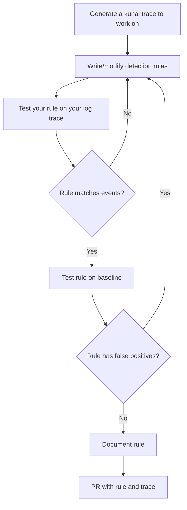

## Disclaimer

We strive to provide high-quality rules, but this repository comes with no warranty. The effectiveness of these rules may vary depending on your environment. Some rules may result in **false positives**, while others might miss certain detections (false negatives).

## Important

No rule should be committed to the `main` branch. Rules must be committed to branches corresponding to the Kunai version for which they are intended.

## Creating Rules

**IMPORTANT:** it is accepted to have **false positives** for rules with a severity in **[1;5]** as those are considered as suspicious but are here to stack up.

## Documenting Rules

Rules not documented properly **will not be merged** to the repo. Here are the **minimal documentation** required to have rules accepted in the repo.
* **tags**: at least `'os:linux'`
* **authors**: at least one
* **attack**: at least one
* **comments**:
    * at least one comment to tell what the rule tries to catch
    * at least something that help **cross-referencing** your rules (hash, url to a threat report ...)

## Rule Severity Attribution

**Severity** is used to encode the importance of an event matching the rule. Following are some important points about detection rules:

- **Severities are cumulative so if one event matches two rules the severities will be added**. This is a great way to encode some suspicious things that may stack up.
- **Maximum severity** is always bounded to **10** (even when stacking up)
- **[1;5]**: this is suspicious use different value to graduate "suspiciousness"
- **6: Moderate Impact**  
  Events that might indicate a compromised or abnormal state but don’t immediately pose a significant risk. These could involve unusual but non-critical activities that require investigation.

- **7: Elevated Risk**  
  Events that show signs of active exploitation or system abuse. While not immediately critical, these events could potentially evolve into a more serious breach if left unaddressed.

- **8: High Impact**  
  Events that suggest that an attacker is gaining deeper access or that systems may be under direct attack. Immediate attention is required to prevent further escalation.

- **9: Severe Threat**  
  Events that indicate near-absolute certainty of a compromise or attack with potential damage to critical systems. This requires rapid response and investigation.

- **10: Critical**  
  Maximum severity, indicating a full compromise or ongoing active attack that could result in substantial data loss, downtime, or other catastrophic effects. Immediate intervention is necessary to contain and mitigate the threat.
